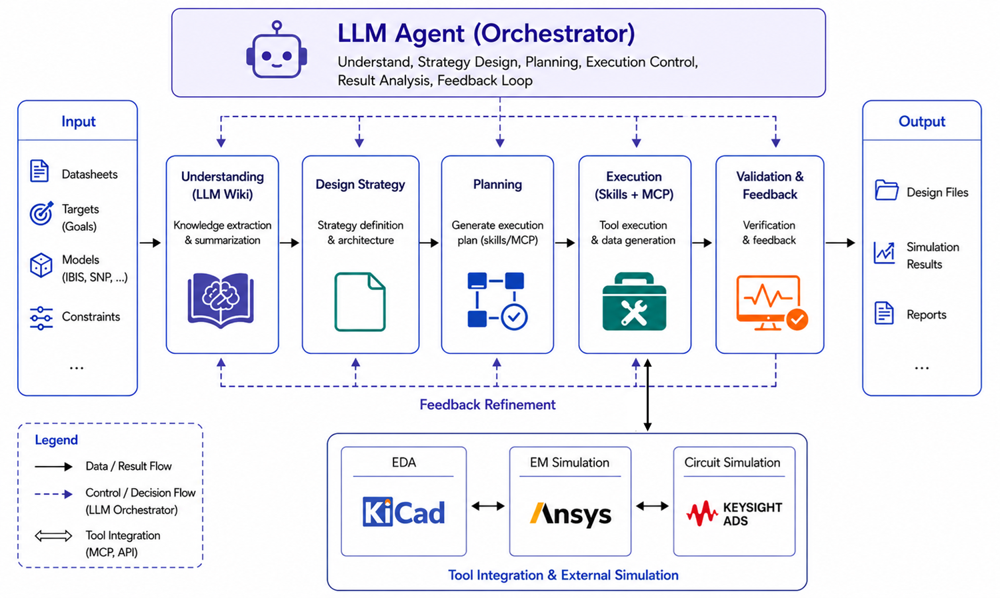

# Signal Integrity Harness

Signal Integrity Harness is a file-based SI/PI engineering harness for turning
electrical specifications into traceable strategy, PCB/package layout, EM
extraction, circuit/bench verification, and reports.

It was built with OpenAI Codex as an engineering-agent workflow: Codex reads
specs, plans the toolchain flow, generates scripts, drives KiCad/HFSS/ADS
automation, inspects failures, and records reusable lessons back into the
repository.



## Demo

Watch the demo video:

[Signal Integrity Harness demo](https://youtu.be/1Y4XYMKkBZM)

## Prerequisites

For the full SI/PI flow, install and license:

- **KiCad** for PCB/package layout generation and inspection.
- **Ansys Electronics Desktop / HFSS 3D Layout** with **PyAEDT/PyEDB** for EM
  import, solve, and Touchstone export. See the official
  [PyAEDT installation guide](https://aedt.docs.pyansys.com/version/stable/Getting_started/Installation.html).
- **Keysight ADS 2025 Update 2 or newer** for ADS workspace, ChannelSim,
  dataset, and report automation.
- **Node.js**, **npm**, and **Python 3.10+**.

Useful local environment variables:

```text
KICAD_CLI=<path-to-kicad-cli>
AEDT_VERSION=2025.1
AEDT_PYTHON=<optional-python-with-pyaedt-and-pyedb>
ADS_PYTHON=<path-to-ADS-python>
HPEESOF_DIR=<path-to-ADS-install-root>
```

## Repository Map

- `CODEX.md`: primary operating rules for Codex/agent sessions.
- `README_AGENT.md`: short handoff rules for a fresh agent.
- `sipi_harness/docs/workflow.md`: full stage workflow and failure handling.
- `sipi_harness/docs/agent_lessons.md`: recurring mistakes and required fixes.
- `sipi_harness/wiki/`: typed SI/PI knowledge layer and raw source staging.
- `sipi_harness/scripts/`: strategy, KiCad, HFSS, ADS, reporting, and validation commands.
- `.codex/skills/`: task skills for PDF evidence, KiCad, HFSS/PyAEDT, and ADS.

## Quick Start

```bash
git clone https://github.com/<user-or-org>/Signal_Integirty_Harness.git
cd Signal_Integirty_Harness
```

Before running a real case, read:

```text
README.md
CODEX.md
README_AGENT.md
sipi_harness/docs/workflow.md
```

Install harness dependencies and run the contract smoke test:

```bash
cd sipi_harness
npm install
npm run smoke:sample
```

The smoke test checks repository contracts without launching KiCad, AEDT, or
ADS.

## Full Flow

The intended handoff is:

```text
Spec evidence -> Strategy -> KiCad/Package -> HFSS 3D Layout -> Touchstone -> ADS Bench -> Reports
```

Core rules:

- Compliance thresholds must come from source evidence, not memory.
- KiCad/package routing must pass geometry gates before HFSS handoff.
- HFSS must export a verified non-empty Touchstone before ADS runs.
- ADS must use the spec-required bench when available; fallback S-parameter
  reports are sanity/proxy evidence, not compliance.
- Lessons from failed attempts should be recorded in docs or skills, not only
  in chat logs.

## Sharing Policy

Safe to share:

- harness scripts,
- general methodology docs,
- schemas/templates,
- skill instructions,
- redistributable example scaffolds.

Check before sharing:

- specification PDFs,
- copied book or paper content,
- extracted proprietary requirements,
- generated PCB/package design files,
- AEDT projects, ADS workspaces, Touchstone files, datasets, and reports.

Do not share EDA executables, licenses, local lock files, private caches, or
machine-specific environment settings.
