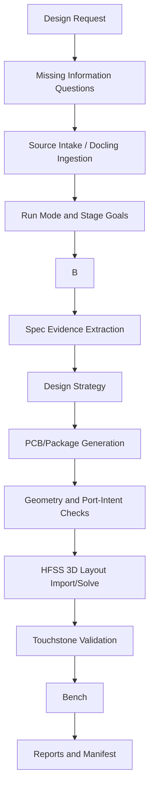

# Workflow

The harness implements a spec-driven SI/PI flow from knowledge intake to layout,
EM extraction, circuit/spec verification, and reporting.



## 0. Intake Questions, Source Upload, and Run Mode

- Purpose: Collect missing design inputs, invite source material, and
  decide how much autonomy the harness should use for the active case.
- Input: design request, engineer preference, risk level, tool availability,
  raw/reference sources when provided.
- Output: manifest entry with run mode, stage goals, review gates, and
  completion criteria; Docling conversion manifest when sources are ingested.
- Tool: agent prompt plus case manifest update; `scan:knowledge`,
  `ingest:docling`, `register:docling`, and PDF evidence extraction when
  sources are provided.
- Failure: running toolchain stages without a selected mode or without required
  stage outputs.
- Automation: manual choice, then automated enforcement.

Ask for useful missing information before mode selection:

- governing spec/version/source
- interface, lane count, data rate, channel length, package/PCB class
- stackup, material Dk/Df, layer intent, impedance and geometry constraints
- pin/ball/bump/connector map source and evidence method
- compliance metrics, loading models, masks, source/receiver models
- available KiCad/AEDT/ADS tools and Python environments

Then offer source upload. Raw source folders are
`wiki/raw/datasheet/`, `wiki/raw/papers/`, `wiki/raw/user_notes/`,
`wiki/raw/web_research/`, and case-local
`outputs/<case>/knowledge_intake/user_references/`.

Docling is the preferred converter for PDF, DOCX, PPTX, XLSX, HTML, EPUB,
images, Markdown/text, CSV, email, XML, and LaTeX source intake:

```powershell
npm run setup:docling
npm run scan:knowledge -- --case-dir <case-dir>
npm run ingest:docling -- --case-dir <case-dir> --source-tier tier_0 <path-to-source>
npm run register:docling
npm run refresh:all
```

For a case strategy, raw source folder matches must be converted before they
can affect layout or compliance. The integrated path is:

```powershell
npm run register:raw-sources
npm run report:wiki-strategy -- --case-dir <case-dir> --request-file <request.txt> --auto-ingest-sources
```

This selects request-relevant files from `wiki/raw`, runs case-local Docling
candidate ingest, extracts PDF spec evidence for the best matching PDF, and
then builds `strategy/design_strategy.yaml` from wiki cards plus document/spec
evidence. If the report has raw source group hits but `docling_hit_count=0`,
the strategy has only source metadata and must remain incomplete/proxy for
document-dependent decisions.
If `spec_evidence/spec_candidates.json` exists, the strategy report must show
`spec_evidence_hit_count > 0`; otherwise the governing PDF was extracted but
not fused into `design_strategy.yaml`.
The strategy report must also populate the source-derived bench contract under
`design_strategy.validation_benches`. Source-backed metric families that can be
run with common artifacts appear as `generic_implementation_benches`; metric
families that need a circuit/statistical/tool-specific setup appear as
`blocked_benches` with an `adapter_synthesis` contract. Together these form the
coverage matrix for characteristic impedance, insertion/return loss, crosstalk,
transfer-function/loading metrics, eye/mask, BER/bathtub/contour, and
skew/jitter when the governing source contains those concepts. Do not start
routing or HFSS just because a PDF was selected; start only after the strategy
states which metric families were found, which are blocked/missing, and which
bench implementation or adapter contract will handle them.

Interface/tool-specific adapters are case-local execution helpers. They must be
generated or selected after Strategy extracts `required_benches` from the
governing source. Do not ship or assume a repository-level interface compliance
adapter in the default path. If a required family has no generic implementation,
the Bench stage is blocked until a case-local adapter is implemented or
explicitly waived by the engineer.
Most user cases will not have a custom adapter. In that case, the strategy must
still proceed by separating:

- `generic_implementation_benches`: built-in checks that can run from standard
  artifacts, such as geometry/TDR impedance, Touchstone insertion loss, return
  loss, crosstalk, and route/group-delay skew.
- `blocked_benches`: source-backed requirements that need a selected circuit
  topology, loading model, statistical eye setup, BER contour, or other
  adapter-specific implementation.

Do not use an interface adapter as the only way to make Strategy succeed, and
do not replace blocked source-backed requirements with proxy S-parameters.
Blocked benches are still reportable. A blocked bench means the harness has
source-backed evidence for a requirement but does not yet have an executable
implementation. Before abandoning the metric, generate an adapter plan:

```powershell
npm run plan:bench-adapter -- --strategy <case-dir>\strategy\design_strategy.yaml --out-dir <case-dir>\strategy\adapter_plan
```

The generated plan is the contract for an on-demand adapter. When a verified
Touchstone exists and the extracted strategy contains enough source-derived
topology/equations/model data, the harness must synthesize and run the
case-local ADS bench instead of stopping at the plan:

```powershell
npm run bench:ads-from-strategy -- --strategy <case-dir>\strategy\design_strategy.yaml --touchstone <channel.sNp> --port-intents <case-dir>\simulation\hfss3dlayout_port_intents.json --data-rate-gbps <rate> --workspace <case-dir>\bench\ads_from_strategy_wrk
```

If the plan lists missing topology, equations, model data, or tier-0 limits,
the Bench stage remains blocked and the report must show the missing evidence.
The command also emits case-local adapter skeletons under
`adapter_plan/generated_adapters/`. These skeletons are runnable and write
blocked result JSON until the metric-specific ADS/SPICE/ChannelSim calls are
implemented. Treat skeleton generation as a diagnostic artifact only; it is not
the completion point when the bench can be synthesized from strategy and
Touchstone evidence.
The repo wiki card folders are scaffold until populated with reviewed typed
cards. README-only folders or raw source group names do not count as design
knowledge. Strategy signoff must cite content-level evidence: reviewed typed
cards, Docling/spec extraction records, web/user-reference summaries, or
explicit evidence gaps.

This intake is a blocking gate. If the engineer has not answered whether they
will provide source material and has not selected a run mode, ask and wait. Do
not infer a default mode, create outputs, install dependencies, search the web,
load stage-specific skills, or start Strategy/Layout/Solve/Bench work from the
first design request.

Supported modes:

- Stage Review Mode: finish one stage, write its report, then pause for engineer
  review before continuing. Pause after all five stages: Strategy, PCB/Package,
  EM Solve, Bench, and Report.
- End-to-End Goal Mode: run through all stages until final report exists. If
  the final report shows failed metrics and revision is possible, loop back to
  Strategy and continue automatically. Stop only on unresolved external blockers
  such as missing user evidence, missing license/tool access, or impossible
  constraints.
- Single-Pass Design Mode: generate one design candidate and reports without
  design-revision loops. Failures are reported as-is.

This design run mode is separate from execution mode. Use
`harness.design_run_mode` for the three modes above and
`harness.execution_mode` for `dry_run` versus `execute`.

Report checkpoints are independent of mode. Every stage boundary must save the
current stage PDFs and record the checkpoint in the manifest:

```powershell
npm run report:checkpoint -- --case-dir <case-dir> --stage <stage> --status completed
```

Use `--status proxy`, `--status blocked`, or `--status failed` when the stage
does not produce compliance-ready evidence. End-to-End and Single-Pass modes do
not pause at every boundary, but they still write these report checkpoints.

## Subagent and Background Work Policy

The main agent owns the case state. It defines the stage goal, freezes input
paths, validates returned artifacts, updates `manifest.json`, assigns
pass/proxy/blocked status, and performs Stage Review pauses. Subagents are
opt-in, not the default execution model. Use them only for bounded file-based
execution where the input artifact, required output artifact, and validation
contract are already frozen:

- Optional Obsidian vault export after graph inputs are stable.
- Optional KiCad/package generation, preview rendering, and geometry checks.
- Optional HFSS/PyAEDT import, port validation, solve, and Touchstone export.
- Optional ADS or benchmark workspace/netlist/dataset/plot generation.

Do not run `refresh:all` concurrently with strategy generation unless the main
agent has already frozen the source registry/wiki graph inputs for the case.
Obsidian export is optional and may run in parallel with design work because it
does not decide strategy. KiCad/HFSS/ADS subagents may save context, but they
must return exact artifact paths, logs, checker summaries, and blockers. They
must not change run mode, invent spec limits, replace missing solver output
with proxy data, or claim compliance. Stateful EDA repair loops should stay in
the main agent by default, especially routing-violation repair, HFSS
setup/sweep/Touchstone export debugging, and benchmark connectivity repair.

Standard stage goals:

- Strategy: `strategy/design_strategy.yaml`, strategy PDF, source lineage, and
  missing/blocking values.
- PCB/Package: layout/project bundle, stackup, route records, geometry report,
  and port-intent JSON.
- EM Solve: solver project/database, verified ports, solve status, and
  Touchstone or blocker.
- Bench: benchmark workspace/netlist/schematic, datasets, metric plots, and
  pass/fail/proxy status.
- Report: stage PDFs, final report, manifest, and shareability notes.

## 1. Knowledge Intake

- Purpose: Collect design strategy sources before geometry generation.
- Input: design request, web research summaries, user references, and local
  `wiki/raw/datasheet/` specification candidates.
- Output: case-local knowledge intake records and wiki fusion input.
- Tool: `init:knowledge`, `scan:knowledge`, `ingest:docling`,
  `register:docling`, `register:knowledge`, `refresh:all`.
- Failure: missing source provenance, copyrighted source copied into Git.
- Automation: semi-automated; source selection requires engineer review.

For books and long PDFs, do not rely on arbitrary fixed-size chunks as design
knowledge. Register the source first, then extract section/table/figure/equation
candidates with page provenance. See `docs/document_ingestion.md` for the
semantic chunking policy and Docling/DocLang ingestion path.

## 2. Spec Evidence Extraction

- Purpose: Extract text, tables, equations, masks, and figures used by the
  design.
- Input: governing PDF or structured spec source.
- Output: `spec_evidence/` manifest, inventory, candidates, review queue, page
  text, page blocks, rendered images, crops, notes, and compliance metric
  coverage.
- Tool: `extract:spec-evidence` for whole-document inventory, then
  `extract:pdf-evidence` for focused page/figure extraction; manual visual
  review for maps/masks.
- Failure: figure-derived map used without evidence-to-geometry audit.
- Automation: semi-automated.

The spec extraction layer is separate from the LLM wiki. The wiki provides
reusable design rules and validation method cards; `spec_evidence/` provides
case-local tier-0 governing values, maps, equations, masks, and loading models.
Do not promote a candidate numeric value from `spec_candidates.json` into a
pass/fail constraint until it is linked to page/table/figure/equation evidence
and reviewed.

The repo-level `wiki/raw/datasheet/` folder is only a local source library. A
PDF in that folder becomes actionable only after it is selected for a case and
extracted into `outputs/<case>/spec_evidence/`.

Spec extraction must produce a coverage matrix for compliance metric families,
not only isolated candidate values. The agent must scan the whole governing
source for frequency-domain S-parameter or transfer-function requirements,
impedance/TDR, crosstalk, skew/timing, jitter, transient waveform/eye/mask,
BER/bathtub/contour, loading/source/receiver models, PDN/rail limits where
applicable, and required report artifacts. Each discovered family must be
mapped to `implemented`, `proxy_only`, `not_applicable`, or
`blocked_missing_evidence` before the Strategy stage can pass. A spec-defined
eye/mask/BER/jitter requirement is a transient/statistical bench requirement;
it cannot be closed by an S-parameter-only fallback report.

## 3. Design Strategy

- Purpose: Define stackup, routing, EM setup, benchmark benches, metrics, limits, and
  reports before layout.
- Input: request, wiki pages, research, references, spec evidence.
- Output: `strategy/design_strategy.yaml` and strategy PDF.
- Tool: `report:wiki-strategy` or a case-specific strategy builder.
- Failure: final benchmark benches not specified.
- Automation: semi-automated; human review required.

For non-ASCII design requests on Windows, write the request to a UTF-8 text file
and call `report:wiki-strategy` with `--request-file <request.txt>` rather than
passing the text through multiple command-line layers.

The strategy must preserve the compliance metric coverage matrix from
`spec_evidence/`. It should name every required bench, the source
page/table/figure/equation, the exact loading/source/receiver model, the metric
equation, and whether the bench is exact, proxy, not applicable, or blocked.
If request-relevant raw documents exist, call `report:wiki-strategy` with
`--auto-ingest-sources` or provide `--spec-evidence` and case-local Docling
artifacts explicitly. Do not sign off a strategy that only cites raw source
groups.

## 4. PCB/Package Generation

- Purpose: Generate complete KiCad/package/interconnect artifacts.
- Input: strategy, stackup, pin/bump map, routing rules.
- Output: KiCad project/board, manifest, geometry report, layout preview image,
  same-layer crossing/short JSON, port-intent JSON.
- Tool: case generator, KiCad CLI/MCP, deterministic router such as A*.
- Failure: pad overlap, same-layer crossing, missing return path, failing skew.
- Automation: semi-automated.

Endpoint maps are mandatory routing inputs. If the governing specification
contains a bump map, ball map, connector pinout, escape table, or package
figure, extract and review that evidence before routing and reference it from
the generated coordinates. If no such map is available, generate a synthetic
case-local bump/ball/pad map from the request parameters before routing. Store
the synthetic map under `outputs/<case>/routing/` with its pitch, row/column
coordinates, lane mapping, side/module placement, and assumptions. Synthetic
maps are valid for topology exploration and proxy EM extraction, but compliance
reports must state that endpoint placement is synthetic unless the governing
spec explicitly allows it.

Routes derived from endpoint maps must be generated by A* or an equivalent
deterministic router. Use 45-degree diagonal routing by default
(`allow_diagonal: true`) unless manufacturing rules, the governing spec, or the
case strategy explicitly prohibit it. Diagonal steps must use Euclidean or
octile costs, avoid corner-cutting through inflated obstacles, and pass the
same-layer crossing/short checker before HFSS handoff.
Avoid unnecessary 90-degree bends in high-speed channels; use them only for a
documented escape or clearance constraint.
Do not turn diagonal routing off as a repair shortcut. If a diagonal route
fails geometry, repair lane ordering, fanout shape, allowed layer assignment,
keepouts, spacing, endpoint pairing, or stackup assumptions while keeping
`allow_diagonal: true`. `allow_diagonal: false` requires an explicit
manufacturing/spec reason and engineer approval.
A missing route-result settings block, `allow_diagonal: false` without
approval, or avoidable orthogonal-only high-speed route is a PCB/package gate
failure.
Optimize for shortest routed centerline length first. Endpoint/lane ordering
should minimize total octile/Manhattan distance and avoid obvious crossings
before A* runs. Length-matching detours, if required, are added only after the
shortest valid routes pass the geometry gate and must be recorded separately.
When a target impedance exists, choose the initial route width/spacing from the
active stackup/material using a documented line calculator, 2D extractor, or
rough microstrip/stripline estimate before routing. Record the estimate,
formula/model, reference layer, Dk/Df, applied width/spacing, and any pitch
clamp in the route result and manifest. This is pre-layout guidance only;
HFSS/bench verification remains the authority for compliance.
For a new generic channel/package case, prefer the repository generic case
generator before adapting an example-specific script:

```powershell
cd <repo>\sipi_harness
npm run create:channel-case -- --case-dir <case-dir> --case-name <case-name> `
  --interface <interface-name> --package-class <package-class> `
  --lane-count <n> --data-rate-gbps <rate> --channel-length-mm <length> `
  --layer-count <layers> --dk <Dk> --df <Df> --bump-pitch-um <pitch> `
  --target-impedance-ohm <Z0> --overwrite
```

If reviewed spec/user endpoint evidence exists, pass it with
`--endpoint-map <case-dir>\routing\endpoint_map.json`. If it is absent, the
generator creates a synthetic case-local endpoint map and marks compliance
blocked/proxy until the endpoint placement is reviewed.
The generic helper is:
`npm run estimate:trace-width -- --target-ohm <Z0> --er <Dk> --height-mm <h> --pitch-mm <pitch> --clearance-mm <clearance> --output <case-dir>\routing\trace_width_estimate.json`.

Reference-plane coverage is part of the PCB/package gate. A valid high-speed
EM candidate must record the assigned continuous reference layer/plane for each
routed segment. Local GND tabs or port-reference patches are launch aids only;
they do not replace a channel return path. If an in-stage repair removes the
reference plane, fragments it under the route, or turns the stackup into
signal-only routing, reject the candidate before HFSS and rerun the
PCB/package stage.

In End-to-End Goal Mode, a geometry violation is not a final answer. Stay in
the PCB/package stage and repair the route until the geometry gate passes or a
concrete routing blocker is recorded. Valid repair attempts include rerunning
A* with a revised lane order, diagonal routing enabled, larger keepouts,
adjusted escape/fanout, an alternate allowed signal layer, or a
strategy-approved spacing/stackup change. Record the attempts in the case
manifest and stage report.

After KiCad/package generation, render a human review image:

```powershell
npm run check:kicad-geometry -- --board <board.kicad_pcb> --output <case-dir>\reports\kicad_same_layer_geometry.json --manifest <case-dir>\manifest.json
npm run render:kicad-preview -- --board <board.kicad_pcb> --output <case-dir>\reports\kicad_layout_preview.png --manifest <case-dir>\manifest.json
npm run prompt:stage-review -- --stage pcb --case-dir <case-dir>
```

The same-layer geometry check is a mandatory pre-HFSS gate and must pass for a
valid EM candidate. It catches different-net same-layer crossings, shorts,
trace-to-pad/via shorts, and pad/via overlaps from the generated KiCad board.
The review message should show the PNG when the interface supports local image
display. The preview does not replace DRC or geometry gates, but PCB/package
stage review is incomplete without it.

KiCad geometry gates operate on the source board. The HFSS import stage must
also validate post-conversion AEDB primitives because the converter can create
extra launch-pad, via-pad, junction-pad, trace-outline, or port-tab polygons.
If any same-layer different-net AEDB polygon primitives overlap, block EM even
when the KiCad board and DRC appeared clean.

## 5. Geometry and Port-Intent Checks

- Purpose: Block invalid layouts before expensive solver runs.
- Input: KiCad board/package data, route records, port intents.
- Output: check summary in manifest, `reports/kicad_same_layer_geometry.json`,
  `reports/port_launch_clearance.json`, and stage report.
- Tool: harness checks and KiCad DRC where available.
- Failure: unconnected nets, same-layer crossing/short checker missing or
  failing, invalid port layer/reference, invalid circuit-port terminal
  placement, wrong port count.
- Automation: automated with human review on warnings.

HFSS 3D Layout ports must be exportable after AEDB import/reopen. For
KiCad/AEDB handoff, use AEDB polygon-edge circuit ports by default:
`--port-method edb_polygon_edge`. `edb_path_edge`, coordinate two-point circuit
ports, and pin ports are explicit debug overrides only, because they can attach
to long trace side edges, wrong Start/End edges, or misplaced coordinates even
when the GUI shows port labels. The port-placement gate must prove that the
intended signal launch is a short endpoint pad/tab edge and that local reference
geometry is available and avoids via holes/antipads.

Do not accept a port just because it is visible in AEDT. A bad circuit port can
appear in the GUI and in `app.port_list`, solve with `analyze_setup() == true`,
and still fail Touchstone export. The reference terminal must be a local facing
point on solid reference copper. If the closest point is inside a via
hole/antipad keepout, move the reference terminal to the nearest adjacent solid
copper and keep the terminal span short.

Default polygon-edge import pattern:

```powershell
npm run import:hfss3dlayout -- --port-method edb_polygon_edge --edge-port-type Gap --port-intents <case-dir>\simulation\hfss3dlayout_port_intents.json ...
```

Coordinate-port override pattern for manual/debug use:

```python
oeditor.CreateCircuitPort([
    "NAME:Location",
    "PosLayer:=", "F.Cu",
    "X0:=", "2.000mm",
    "Y0:=", "2.540mm",
    "NegLayer:=", "In1.Cu",
    "X1:=", "1.895mm",
    "Y1:=", "2.540mm",
])
```

If the imported geometry exposes stable primitive edges, use an
edge-to-reference-edge circuit port on small launch/GND tabs:

```python
h3d.create_edge_port(
    assignment="SIGNAL_PORT_TAB",
    edge_number=selected_signal_edge,
    is_circuit_port=True,
    reference_primitive="GND_PORT_TAB",
    reference_edge_number=selected_reference_edge,
)
```

The selected signal edge must be terminal-like. Reject long trace side edges,
edges too far from the port-intent coordinate, and edges that sit on a route
sidewall instead of a launch/pad end. Misplaced data-lane ports often happen
when the nearest-edge selector chooses a long diagonal trace side edge; that is
a blocker, not an acceptable port. Default gate limits are 0.30 mm maximum edge
length and 0.05 mm maximum distance from the port-intent coordinate to the
selected edge. The 0.30 mm default accepts short launch tabs around 0.26 mm
while still rejecting long trace sidewalls.

Run:

```powershell
npm run check:port-launch -- --board <board.kicad_pcb> --port-intents <case-dir>\simulation\hfss3dlayout_port_intents.json --summary <case-dir>\reports\port_launch_clearance.json
```

This gate must pass before EM import/solve.

## 6. HFSS 3D Layout Import/Solve

- Purpose: Convert PCB/package geometry to AEDB/AEDT and extract S-parameters.
- Input: board/database, port intents, stackup, solver config.
- Output: AEDB/AEDT, solve summary, verified Touchstone.
- Tool: `import_odb_to_hfss3dlayout_project.py`,
  `solve_hfss3dlayout_touchstone.py`.
- Failure: empty AEDB, non-persistent ports, solved true but no export data,
  missing sweep data.
- Automation: semi-automated; inspect GUI for first-time import paths.

Always pass the intended AEDT version explicitly to import, solve, and export
commands. A summary produced by a different AEDT major release is not accepted
as a portable handoff artifact. The solve script should enable
export-on-completion where available, then validate explicit PyAEDT/native
Touchstone export. If `analyze_setup()` returns true but no non-empty
Touchstone exists, classify the stage by failure mode rather than calling it
solved.

The normal harness command for this stage is the solve wrapper:

```powershell
cd <repo>\sipi_harness
npm run solve:hfss3dlayout-touchstone -- `
  --project <case-dir>\simulation\hfss3dlayout\<case>_edge.aedt `
  --version 2025.1 --expected-version 2025.1 --non-graphical `
  --setup Setup_5xNyq --sweep Sweep_5xNyq_121 `
  --adaptive-ghz <stop-ghz> --start-ghz 0.01 --stop-ghz <stop-ghz> `
  --points 121 --sweep-type Fast `
  --touchstone <case-dir>\simulation\hfss3dlayout\<case>.sNp `
  --summary <case-dir>\simulation\hfss3dlayout\<case>_solve_summary.json
```

Do not use `export:hfss3dlayout-existing` or its compatibility alias
`export:hfss3dlayout-native` as the normal solve path. Those commands only
retry export from an already-solved, already-registered AEDT solution and will
not repair missing HFSS 3D Layout setup/sweep registration.

After port validation and before any long solve, verify that the HFSS 3D Layout
setup and sweep exist in the native AEDT solution tree. PyAEDT can return a
setup object while the imported 3D Layout design still has no registered native
setup, which leads to `Analyze` or export calls reporting success-like states
with no solution data. The gate is:

```python
solve_setups = oDesign.GetModule("SolveSetups")
assert "Setup1" in list(solve_setups.GetSetups())
assert "Sweep1" in list(solve_setups.GetSweeps("Setup1"))
assert any(name.startswith("Setup1 : Sweep1") for name in solve_setups.GetAllSolutionNames())
```

If this gate fails, create or repair the setup/sweep first and save/reopen the
project before solve/export. Do not change a known-good polygon-edge port
method just because export data is missing; missing native setup/sweep is a
separate blocker.

A visible sweep name is not sufficient. HFSS 3D Layout can contain a visible
`Sweep1` with an empty frequency table, which then exports only `LastAdaptive`
or no network data. If an existing sweep does not expose the requested
frequency range, delete and recreate it before solve/export. Prefer
`Hfss3dLayout.create_linear_count_sweep(...)`. For native AEDT fallback, use
the HFSS 3D Layout `Sweep3DLayout` template and set:

```python
props["Sweeps"]["Variable"] = "Freq"
props["Sweeps"]["Data"] = "LINC 0.01GHz <stop-ghz>GHz 121"
props["FreqSweepType"] = "kInterpolating"
```

Do not rely on generic `RangeStart`/`RangeEnd` properties alone for HFSS 3D
Layout sweeps; they can create a sweep object without a real frequency row.
Export is valid only when the requested `Setup:Sweep` has frequency data
through the required stop frequency.

If solve succeeds but no Touchstone exports, first check whether the project
used coordinate/pin ports instead of the required polygon-edge path. Rebuild the
import with `--port-method edb_polygon_edge` and verify setup/sweep
registration before changing the route. Coordinate/pin port import is disabled
for normal harness runs and requires `--allow-coordinate-port-override` for a
documented manual/debug experiment. For explicit coordinate-port override
debugging, repair `positive_x/positive_y` and `negative_x/negative_y` so both
resolve on real copper. The reference terminal should be a nearby facing
reference edge; if the closest reference point falls inside a via hole, antipad,
or clearance keepout, move it to the nearest adjacent solid reference copper
while keeping the terminal span short. Rerun `check:port-launch` before HFSS
import.

After setup and sweep creation, solve the requested `Setup : Sweep` as a
blocking operation and verify that exact sweep has report-visible data before
Touchstone export. Do not accept `Last Adaptive` as the channel handoff result:
it normally contains only the adaptive frequency, such as the final 6 GHz point,
and is not the 0.01-6 GHz sweep requested by the strategy.

Do not repair HFSS failure by weakening the electrical layout. Any reroute
after import/solve/export failure must preserve the active strategy stackup,
continuous reference plane, port-reference model, impedance intent, and
diagonal-routing rule. A no-reference-plane reroute may be useful as a geometry
debug artifact, but it is not a valid HFSS handoff candidate.

Stage Review Mode gate: before running the solve, print the setup review and
wait for engineer approval:

```powershell
npm run prompt:stage-review -- --stage hfss --case-dir <case-dir> --data-rate-gbps <rate> --sweep-type Fast --points 11
```

The agent should keep working until the HFSS setup is reviewable: strategy,
board/database, port-intent JSON, proposed port method, expected port count,
sweep type, stop frequency, Touchstone target, and proxy/compliance status must
be visible.

## 7. Touchstone Validation

- Purpose: Ensure the EM result is usable by ADS or another circuit tool.
- Input: `.sNp`, port-intent JSON.
- Output: port count/order/frequency range check.
- Tool: `check_channel_touchstone.py` or solver summary validation.
- Failure: wrong N-port dimension, missing data lines, unexpected port order.
- Automation: automated.

If PyAEDT and native AEDT export both fail with missing solution data,
`GetAllPortsList`, or boundary-module errors while GUI ports appear present,
record `invalid_or_non_exportable_hfss3dlayout_ports` and return to port
creation. Do not proceed to compliance or ADS. Repair the real handoff until a
verified non-empty Touchstone exists, or stop with a blocker. The repair loop
should try the smallest valid change first: geometry gate reroute, port-intent
correction, alternate port method, AEDB rebuild, target AEDT version reopen,
native export confirmation, and then a simplified candidate layout if the
original candidate cannot produce exportable network data.
If ports and native setup/sweep registration are correct, inspect stale AEDT
result state before changing port method. A known successful recovery kept Gap
polygon-edge ports unchanged, closed only harness-started non-graphical
`ansysedt.exe -grpcsrv -ng` sessions, removed only case-local `.asol_priv` /
`*.semaphore` files under that result directory, reran the solve in a clean
working directory, and then exported a non-empty Touchstone. Trying Wave edge
ports did not fix that failure.

## 8. Bench

- Purpose: Implement the exact spec-defined frequency-domain and/or transient-domain benchmarks.
- Input: verified HFSS or measurement Touchstone/S-parameter data, loading model, sources, bit rate, limits, masks, and time-domain stimuli as applicable.
- Output: benchmark workspace or scripts, schematics/netlists when applicable, datasets, plots, and metrics.
- Tool: ADS DE automation, circuit simulator, S-parameter post-processing, or manually reviewed benchmark schematic.
- Failure: invalid schematic connectivity, wrong component filename syntax,
  dataset path mismatch, using proxy equations.
- Automation: semi-automated; schematic validation is required.

If the strategy/spec evidence contains VTF, crosstalk equations, explicit
source/load R/C models, eye diagram, eye mask, BER contour, bathtub, jitter, or
another spec-defined benchmark, the Bench stage must implement that benchmark
or stop as `blocked_missing_spec_bench_implementation`. Do not close the Bench
stage with the spec-neutral S-parameter fallback. The fallback can be generated
only as an explicit diagnostic supplement and must be labeled non-compliance.

For lane-count N, build spec crosstalk/eye benches from the full S(2N)P channel
unless the governing spec explicitly defines a reduced subchannel method. Run
every required victim lane and include all N-1 aggressors when the spec defines
aggressor-inclusive crosstalk, eye, or jitter conditions. A `.s6p` or 3-lane
template is a smoke example only and cannot close an x8/x16/x32 Bench stage.
If ADS workspace creation, netlisting, dataset generation, or BER contour
extraction fails, repair that real bench or mark the Bench stage blocked; do
not create proxy datasets as a substitute.
For ADS ChannelSim eye/mask report extraction, prefer schematic-run datasets
stored under the ADS workspace `data/` folder over `netlist_runs/` diagnostic
datasets. The report extractor should search for variables such as
`ChannelSim1.TDM.Eye.EYE_L0`, `ChannelSim1.TDM.EyeMeasurements.EYE_L0`, and
`ChannelSim1.TDM.Eye.BER.EYE_L0` before declaring density or BERContour
missing.

For lane-count N eye/mask requirements, generate every victim lane. A lane-0
eye diagram is only a smoke result. The robust generic ADS path is one
ChannelSim run per victim lane with the full S(2N)P channel and all applicable
aggressors, followed by one combined N-panel report. Do not rely on a single
ChannelSim run with N Eye Probe components unless the exact ADS version has
been proven to save all outputs cleanly; this pattern has produced dirty partial
datasets after `hpeesofsim` crashes. Per-lane netlists should use the full
ADS-DE ModelExtractor parameter set rather than a shortened Eye Probe line.

Before ChannelSim eye or BER simulation, audit the verified EM Touchstone
frequency grid. If the point count or max frequency step is too sparse for eye
analysis, interpolate the real Touchstone into a case-local dense
`_eye_interp.sNp` file and use that file for the eye bench:

```powershell
npm run touchstone:resample-eye -- --input <channel.sNp> --output-dir <ads-workspace>\data --data-rate-gbps <rate>
```

This step uses complex linear interpolation in RI domain, preserves port order,
and writes `eye_touchstone_preprocess_summary.json` when called through
`bench:ads-from-strategy`. It is not a substitute for missing HFSS data; if no
verified Touchstone exists, the Bench stage remains blocked.

Generated ADS workspaces must pass a GUI-load sanity gate before they are
reported. Do not write a hand-made `workspace.ads` placeholder into a workspace
directory; ADS can treat that file as an invalid workspace file. For SnP benches
run:

```powershell
npm run check:ads-workspace -- --workspace <ads-workspace> --netlist <ads-workspace>\reports\<bench>.netlist.log --port-count <N> --summary <ads-workspace>\reports\ads_workspace_check.json
```

The check must confirm `lib.defs`, `cds.lib`, `data/`, and `reports/` exist,
the fake `workspace.ads` placeholder is absent, and fixed SnP netlists use
`p1 ... pN 0` in electrical port order.

Stage Review Mode gate: before running ADS or benchmark verification, print the
bench setup review and wait for engineer approval:

```powershell
npm run prompt:stage-review -- --stage ads --case-dir <case-dir> --touchstone <channel.sNp>
```

The agent should keep working until the bench setup is reviewable: Touchstone
mapping, port order, workspace path, exact spec equation/loading model status,
fallback/proxy status, expected plots, datasets, and report outputs must be
visible.

## Context Continuity

Long EDA runs often span context compaction. Each stage must update
`outputs/<case>/agent_state.md` or `outputs/<case>/agent_state.json` before and
after long-running commands with the active case path, run mode, current stage
goal, required artifacts, exact next command, EDA/Python paths, blockers,
no-proxy rules, and handoff files. After compaction or a fresh agent session,
read `CODEX.md`, `README_AGENT.md`, this workflow file, the case
`manifest.json`, latest `reports/stage_report_manifest.json`, and agent state
before touching files or launching tools.

Tool-stage subagents are optional and file-in/file-out only. The main agent
keeps stage gates and should handle stateful EDA repair loops directly,
especially routing violations, HFSS setup/sweep/Touchstone debugging, and ADS
connectivity/dataset repair.

## 9. Reports and Manifest

- Purpose: Produce reproducible evidence for each stage.
- Input: all summaries, plots, logs, metrics, waiver records.
- Output: stage PDFs, `manifest.json`, run summary.
- Tool: `generate_stage_pdf_reports.py`, `run_harness.py`.
- Failure: missing metadata, proxy result presented as compliance.

Do not edit files under `sipi_harness/examples/` during a case run. If an
example must be adapted, copy it under `outputs/<case>/automation/` and record
the copy in the manifest.
- Automation: automated, with human sign-off on compliance claims.
